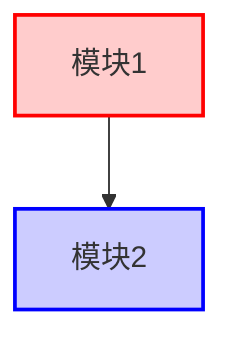

# C 代码库文档生成的约束规范总结

## 一、整体架构约束

### 1. 上下文管理约束
- **禁止累积式上下文**：每个 Phase 处理完后必须清空上下文，不允许将所有数据保留在会话中
- **状态外化原则**：Agent 不在记忆中保存大量数据，所有数据持久化到文件系统
- **索引驱动**：维护轻量级索引（ID + 元数据），详细内容按需加载
- **批处理 + 清空**：分批处理文件（如每批 20 个），处理完立即写盘并清空上下文
- **单批次上下文限制**：每批次处理的上下文应 < 100-200K tokens

### 2. 数据流约束
```
Phase 1: 输出轻量级索引（<100KB）
    ↓
Phase 2: 增量分析，输出到独立文件，无累积
    ↓
Phase 3: 基于索引聚合，按需读取详细数据
    ↓
Phase 4: 目标驱动，只加载相关模块数据
    ↓
Phase 5: 基于模板渲染，生成最终文档
```

### 3. 工作空间结构约束
```
workspace/
├── index/              # 轻量级索引（必须 <1MB）
│   ├── file-index-light.json
│   ├── symbol-index.json
│   └── module-index.json
├── analysis/           # 详细分析（按文件 ID 分片）
│   ├── f001.json
│   └── f002.json
├── relationships/      # 关系数据（只存边，不存节点详情）
│   ├── include-graph-edges.json
│   └── call-graph-edges.json
├── clusters/           # 聚类结果（只存 ID 分组）
│   └── module-clusters.json
└── docs/              # 最终 Markdown 文档
```

## 二、数据格式约束

### 1. 轻量级索引格式
```json
{
  "files": [
    {
      "id": "f001",                    // 必需：唯一标识符
      "path": "src/core/scheduler.c",  // 必需：文件路径
      "type": "source",                // 必需：source/header
      "loc": 1523,                     // 必需：代码行数
      "checksum": "abc123...",         // 必需：用于检测变更
      "analysis_status": "completed",  // 必需：pending/completed/failed
      "analysis_path": "workspace/analysis/f001.json"  // 必需：指针
    }
  ],
  "total_files": 1247,
  "analysis_progress": "847/1247"
}
```

**约束规则**：
- 每个文件条目 < 200 字节
- 不包含文件内容、函数列表等详细信息
- 只保留元数据和指针

### 2. 详细分析文件格式（单个模块）
```json
{
  "file_id": "f001",
  "module_name": "scheduler",
  "subsystem": "核心调度子系统",
  "source_file": "src/core/scheduler.c",
  "header_file": "include/core/scheduler.h",
  "loc": 1523,
  "last_modified": "2026-01-15",
  "responsibility": "实现进程调度的核心逻辑...",  // 最少 50 字符
  "dependencies": [...],
  "dependents": [...],
  "core_logic": "...",
  "data_structures": [...],
  "call_chains": [...],
  "public_interfaces": [...],
  "private_functions": [...],
  "error_handling": "...",
  "memory_management": "...",
  "concurrency_notes": "..."
}
```

**约束规则**：
- 每个文件独立存储
- 不在一个 JSON 中包含多个模块的详细分析
- `responsibility` 字段最少 50 字符
- 所有文件路径使用相对路径

### 3. 关系图格式
```json
{
  "edges": [
    {"from": "f001", "to": "f042", "type": "include"},
    {"from": "f001", "to": "f015", "type": "calls", "function": "kmalloc"}
  ],
  "node_details_dir": "workspace/analysis/"  // 指针，不包含节点详情
}
```

**约束规则**：
- 只存储关系（边），不存储节点的详细信息
- 节点详情通过 `node_details_dir` + `file_id` 按需读取

## 三、JSON Schema 约束

### 1. 模块详细分析 Schema
```json
{
  "$schema": "http://json-schema.org/draft-07/schema#",
  "type": "object",
  "required": [
    "module_name",
    "source_file",
    "responsibility",
    "public_interfaces"
  ],
  "properties": {
    "module_name": {"type": "string"},
    "responsibility": {
      "type": "string",
      "minLength": 50  // 强制最少 50 字符
    },
    "public_interfaces": {
      "type": "array",
      "items": {
        "type": "object",
        "required": [
          "signature",
          "description",
          "parameters",
          "return_value"
        ],
        "properties": {
          "signature": {"type": "string"},
          "description": {
            "type": "string",
            "minLength": 20  // 强制最少 20 字符
          },
          "parameters": {"type": "array"},
          "return_value": {"type": "string"}
        }
      }
    }
  }
}
```

### 2. Schema 验证流程约束
- **输出前验证**：Agent 在输出 JSON 后必须进行 Schema 验证
- **验证失败处理**：如果验证失败，Agent 必须重新生成
- **最多重试次数**：3 次
- **人工介入**：3 次失败后标记为 "需要人工审核"

## 四、文档模板约束（.md.eta）

### 1. 模板层级结构
```
output-templates/
├── 01-project-overview.md.eta       # 项目简介
├── 02-repository-structure.md.eta  # 仓库结构
├── 03-subsystem-overview.md.eta    # 子系统概览
├── 04-module-detail.md.eta         # 单模块详细文档
└── 05-api-reference.md.eta         # API 参考
```

### 2. 模板变量命名约束
- **使用 `it.` 前缀**：所有变量通过 `it` 对象访问
- **驼峰命名**：`it.moduleName`，`it.publicInterfaces`
- **数组遍历**：使用 `forEach`，避免 `for` 循环
- **条件渲染**：使用 `<% if (condition) { %> ... <% } %>`

### 3. 模板输出约束
```markdown
<!-- 必需的文档头部 -->
# <%= it.project_name %> - <%= it.document_title %>

<!-- 必需的元信息 -->
- **分析日期**: <%= it.analysis_date %>
- **文档版本**: <%= it.doc_version %>

<!-- 必需的内容区域 -->
<%= it.main_content %>

<!-- 必需的文档尾部 -->
---
*本文档由 C Codebase Analyzer 自动生成*
```

### 4. Mermaid 图表约束

#### 4.1 生成 Mermaid 代码的约束
```markdown
<!-- 必须使用 Markdown 代码块包裹 -->
```mermaid
<%= it.mermaid_code %>
```

<!-- 动态生成示例 -->
```mermaid
graph TD
<% it.modules.forEach(function(module) { %>
    <%= module.id %>[<%= module.name %>]
    <% module.dependencies.forEach(function(dep) { %>
    <%= module.id %> -->|<%= dep.type %>| <%= dep.target_id %>
    <% }) %>
<% }) %>
```
```

#### 4.2 Mermaid 节点 ID 约束
- **必须是合法标识符**：只能包含字母、数字、下划线
- **禁止空格和特殊字符**：`mod_scheduler` ✅，`mod scheduler` ❌
- **中文标签放在方括号内**：`mod1[调度器]` ✅

#### 4.3 Mermaid 复杂度约束
- **单图节点数限制**：≤ 50 个节点
- **超出限制处理**：分多个子图展示
- **推荐图表类型**：
  - 模块依赖：`graph TD` 或 `graph LR`
  - 函数调用：`sequenceDiagram`
  - 数据结构：`classDiagram`
  - 状态机：`stateDiagram-v2`

#### 4.4 Mermaid 样式约束


## 五、文档内容约束

### 1. 分层文档结构约束

```
Level 0: 项目全局视图
  ├─ 项目简介（必需：项目名、语言、总文件数、代码行数）
  ├─ 核心功能列表（必需：至少 3 个）
  └─ 主要子系统（必需：名称、路径、职责）

Level 1: 子系统架构
  ├─ 目录层级树（必需：使用 tree 格式或 Mermaid）
  ├─ 模块列表表格（必需：模块名、文件、代码行数、职责）
  └─ 依赖关系图（必需：Mermaid graph）

Level 2: 模块详细文档
  ├─ 模块信息（必需）
  ├─ 模块职责（必需：≥50 字符）
  ├─ 依赖关系（必需：依赖的模块 + 被依赖的模块）
  ├─ 核心流程（必需：文字描述 + 可选流程图）
  ├─ 数据结构（必需：定义 + 用途 + 生命周期）
  ├─ 公共接口（必需：详细文档）
  └─ 内部实现（可选：静态函数、错误处理、内存管理）

Level 3: 接口文档
  ├─ 函数签名（必需）
  ├─ 功能描述（必需：≥20 字符）
  ├─ 参数说明（必需：每个参数都要说明）
  ├─ 返回值（必需）
  ├─ 使用示例（推荐）
  ├─ 调用者列表（必需）
  ├─ 内部调用列表（推荐）
  └─ 注意事项（推荐）
```

### 2. 字段长度约束

| 字段 | 最小长度 | 推荐长度 | 最大长度 |
|------|---------|---------|---------|
| 项目简介 | 100 字符 | 300-500 字符 | 1000 字符 |
| 模块职责 | 50 字符 | 100-200 字符 | 500 字符 |
| 接口描述 | 20 字符 | 50-100 字符 | 300 字符 |
| 核心流程 | 100 字符 | 300-800 字符 | 2000 字符 |
| 参数说明 | 10 字符 | 20-50 字符 | 150 字符 |

### 3. 表格格式约束

```markdown
<!-- 模块列表表格必须包含以下列 -->
| 模块名 | 文件 | 代码行数 | 核心职责 |
|--------|------|----------|----------|
| scheduler | `scheduler.c`, `scheduler.h` | 1523 | 进程调度核心逻辑 |

<!-- 接口参数表格必须包含以下列 -->
| 参数名 | 类型 | 说明 |
|--------|------|------|
| pid | int | 进程 ID |
```

### 4. 代码块约束

```markdown
<!-- C 代码必须使用 c 语言标记 -->
```c
struct task_struct {
    int pid;
    int priority;
};
```

<!-- 调用示例必须是可编译的代码片段 -->
```c
// 正确的使用方式
task_struct *task = create_task(1, 10);
schedule();
destroy_task(task);
```
```

## 六、Skill 输出约束

### 1. Skill 输出路径约束

```
phase1-collect/
├─ collect-project-metadata.md
│  └─ 输出: workspace/raw/project-overview.json

phase2-analyze-modules/
├─ analyze-single-module.md
│  └─ 输出: workspace/raw/modules/{module-id}.json

phase4-generate-docs/
├─ render-module-docs.md
│  └─ 输出: docs/modules/{module-name}.md
```

**路径命名约束**：
- 使用小写字母和连字符：`project-overview.json` ✅，`ProjectOverview.json` ❌
- 模块 ID 使用 `f001` 格式：4 位数字，前导零
- 模块名使用原始名称：`scheduler.md`，保留原始大小写

### 2. Skill 质量检查清单约束

每个 Skill 必须在输出前执行以下检查：

```markdown
## 质量检查清单

在输出前，确保：
- [ ] 输出的 JSON 符合指定的 Schema
- [ ] 所有必需字段都已填写
- [ ] 字段长度满足最小要求
- [ ] 文件路径使用相对路径
- [ ] 模块引用的 ID 在索引中存在
- [ ] 没有硬编码的绝对路径
- [ ] 所有代码示例可以编译（语法正确）
```

### 3. Skill 错误处理约束

```markdown
## 错误处理

如果分析过程中遇到以下情况：

1. **文件无法读取**
   - 输出: {"status": "error", "reason": "file_not_found", "file": "..."}
   - 继续处理其他文件

2. **代码解析失败**
   - 输出: {"status": "partial", "reason": "parse_error", "parsed_functions": [...]}
   - 记录已解析的部分

3. **依赖关系不完整**
   - 输出: {"status": "warning", "reason": "missing_dependency", "missing": ["mod1"]}
   - 标记为需要后续补充

4. **Schema 验证失败**
   - 最多重试 3 次
   - 3 次后输出: {"status": "failed", "validation_errors": [...]}
```

## 七、执行流程约束

### 1. 批处理约束
```python
# 伪代码
batch_size = 20  # 每批最多 20 个文件
for batch in batches(all_files, batch_size):
    # 1. 读取批次文件
    files_content = read_files(batch)
    
    # 2. 分析（上下文 < 100K tokens）
    analysis_results = analyze_batch(files_content)
    
    # 3. 立即写盘
    for file_id, result in analysis_results:
        write_json(f"workspace/analysis/{file_id}.json", result)
    
    # 4. 更新索引
    update_index(batch, "completed")
    
    # 5. 清空上下文（关键！）
    clear_context()
```

### 2. 增量更新约束
- **变更检测**：使用文件 checksum（MD5/SHA256）
- **只重新分析变更的文件**：对比新旧 checksum
- **级联更新**：如果模块 A 变更，重新分析依赖 A 的模块 B
- **保留历史版本**：可选，用于对比

### 3. 并行处理约束
- **可并行的阶段**：Phase 2（模块分析）
- **不可并行的阶段**：Phase 3（聚合）、Phase 5（文档生成）
- **并行度**：最多 4 个并行任务
- **共享资源保护**：索引文件使用文件锁

## 八、验证和测试约束

### 1. 单元测试约束
每个 Skill 必须提供测试用例：

```json
// test-cases/analyze-module-test.json
{
  "input": {
    "file_path": "test-data/sample.c",
    "expected_module_name": "sample"
  },
  "expected_output": {
    "module_name": "sample",
    "public_interfaces": [
      {
        "signature": "void init(void)"
      }
    ]
  },
  "validation": {
    "schema": "schemas/module-detail.schema.json",
    "min_responsibility_length": 50
  }
}
```

### 2. 集成测试约束
- **小型测试项目**：10-20 个文件
- **中型测试项目**：100-200 个文件
- **大型测试项目**：1000+ 个文件

### 3. 回归测试约束
- **Golden 数据集**：保留已验证的输出作为基准
- **对比工具**：使用 JSON diff 工具对比新旧输出
- **容忍度**：允许描述性文字有差异，但结构必须一致

## 九、人工审核约束

### 1. 审核触发条件
- Schema 验证失败 3 次
- 模块职责描述 < 50 字符
- 公共接口数量 = 0（疑似分析错误）
- 依赖关系循环（可能是真实的，需要确认）

### 2. 审核标记
```json
{
  "module_name": "scheduler",
  "review_status": "pending",
  "review_reason": "schema_validation_failed",
  "review_notes": "责任描述过短，需要人工补充",
  "auto_generated_at": "2026-02-05T10:30:00Z"
}
```

### 3. 审核工作流
```
自动生成 → 标记为待审核 → 人工审核 → 修正 → 标记为已审核 → 重新渲染文档
```

## 十、总结：核心约束清单

### ✅ 必须遵守的硬约束
1. **上下文限制**：单批次 < 100-200K tokens
2. **状态外化**：所有数据持久化到文件系统
3. **Schema 验证**：所有 JSON 输出必须验证
4. **最小字段长度**：responsibility ≥ 50 字符，description ≥ 20 字符
5. **模板格式**：所有文档使用 .md.eta 模板生成
6. **Mermaid 节点限制**：单图 ≤ 50 个节点
7. **批处理后清空**：每批处理完必须清空上下文

### ⚠️ 推荐遵守的软约束
1. **文档长度**：项目简介 300-500 字符
2. **代码示例**：每个接口提供使用示例
3. **图表可视化**：关键流程使用 Mermaid 图表
4. **错误处理说明**：模块文档包含错误处理部分
5. **并发安全性**：多线程模块说明并发注意事项

### 🔧 可配置的约束
1. **批处理大小**：默认 20 个文件，可调整
2. **并行度**：默认 4 个任务，可调整
3. **Schema 严格度**：可选择严格模式或宽松模式
4. **重试次数**：默认 3 次，可调整

---

**这份约束规范的用途**：
- 作为新 Skill 的设计指南
- 作为现有 Skill 的优化依据
- 作为质量保证的检查清单
- 作为多模型协作的统一标准
